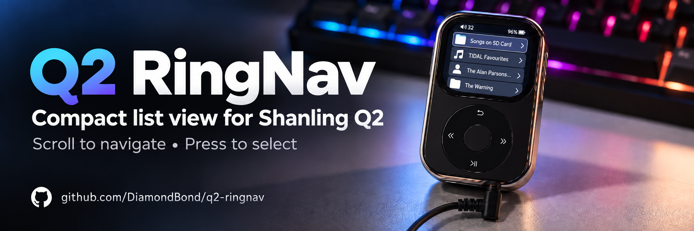

# Shanling Q2 Scroll Wheel Navigation

Firmware mod for the Shanling Q2 that lets you use the scroll wheel to navigate supported menus and press the centre button to select items.

The touchscreen still works normally. Outside supported menus, the wheel continues to control volume.

**Build variants: V3.3R (normal), V3.3C (compact)**

[**Download the latest release**](https://github.com/DiamondBond/q2-ringnav/releases/latest)

## Install

Make sure the Q2 is charged before updating, and do not remove the microSD card during the update.

1. Download the firmware ZIP from the latest release.
2. Unzip it and copy `update.tar` to the root of the microSD card.
3. On the Q2, open **System settings → System Update → TF card update**.
4. Confirm the update and wait for the player to restart.
5. Open **About** and confirm it shows `V3.3R` for normal or `V3.3C` for compact.

To restore stock firmware through the UI, flash the [Shanling Q2 official firmware](https://en.shanling.com/download/150) using **System settings → System Update → TF card update**.

If the UI is not working, use [Shanling's recovery package](https://drive.google.com/file/d/1aINQfJu6n0JTQ4hOzzD1uSpSj3TS_NJj/view?usp=drive_link):

1. Copy the complete `recovery-update` folder to the root of the microSD card.
2. Hold the previous-song button, then power on the Q2 with the centre button.
3. The player will automatically check for a firmware update.

## Variants

### Normal: `Q2.Firmware.V3.3.zip`

Keeps the stock UI and existing controls, including long Return → Home.

### Compact: `Q2.Firmware.V3.3-compact.zip`

Uses a denser layout for Folder and Local Songs browsing:

- Hides the primary toolbar.
- Uses 72-pixel rows.
- Keeps stock artwork at its natural size with an 8-pixel inset.
- Ordinary lists fit four complete rows with stock fonts.

Separate action bars, Play All/sort controls, tabs, editing controls and album grids remain unchanged and may show fewer entries. Settings, online services, Now Playing, Home and dialogs also keep their stock layouts.

The folder artwork setting and saved preferences are preserved.

In compact mode, long Return opens **Now Playing** without restarting playback, including when audio is already playing. On the Now Playing screen, Return still goes back normally whether tapped or held.

Short Return keeps the stock Back action and nested-folder navigation. Other long presses are unchanged. The proposed short Return shortcut on Home is not included.

## Controls

- **Turn the wheel:** Move through supported menu items. Vertical lists move one row per accepted tick.
- **Long-list acceleration:** Lists with more than 16 rows accelerate during continuous same-direction scrolling. Every 100 ms of continuous ticks, with no more than 140 ms between them, adds one row to the step, up to eight rows per tick. Pausing, reversing or reaching an end resets it to one row.
- **Home screen:** Each accepted wheel tick moves one icon. Isolated ticks use a 200 ms slide; consecutive same-direction ticks within 200 ms use 120 ms slides. Reversing immediately changes direction from the current visual position.
- **Centre button:** Short-press to open the highlighted item after a 200 ms confirmation delay.
- **Screen off:** Double-press the centre button within 200 ms. Touch or wheel input cancels a pending single-press action.
- **Touch:** Taps and swipes work normally. Tapping always opens the row touched, even while a list is rebuilding or settling. Tapping another visible pane moves wheel control there.
- **Swipe takeover:** Turning the wheel during a swipe stops scrolling and gives control back to the wheel.
- **Selection position:** Wheel navigation and restored selections keep a small margin from the screen edge where possible.
- **Position memory:** Returning to a recently visited folder, album, query or settings menu restores its selection and scroll position. Up to 64 browsing positions are remembered until power-off.
- **Re-sorted lists:** Recreated non-virtual lists in the same remembered context try to restore the selected row by its text.
- **Selection outline:** Touching the screen hides the custom outline until the next accepted wheel or centre input. After a swipe settles, the row nearest the middle becomes selected for wheel or centre use.
- **Unsupported menus:** The wheel returns to normal volume control.
- **Unchanged controls:** Play/Pause and long-press power behave as stock.

During wheel or centre-button navigation, the selected item gets a rounded translucent-white outline over a subtle dark fill and separator, helping it remain visible over bright artwork.

The Home screen keeps its normal selected-card appearance without the extra outline.

If you find a menu that behaves strangely, please open an issue and include the screen you were on and what you did.

## Changelog

- **V3.3R / V3.3C**: Compact returns from Now Playing with a single Return press again; the stock hold-release latch is cleared on that page instead of swallowing the release and forcing a second press.

Full release history: [docs/changelog.md](docs/changelog.md)

## Documentation

- [Firmware internals](docs/internals.md): stock hooks, selection, position memory, wheel/centre timing and drawing.
- [Build and validation](docs/building.md): building both variants, the MIPS test suite and on-device acceptance checks.
- [Release procedure](docs/releasing.md): packaging, verifying and publishing both ZIPs.
- [Compact mode](docs/compact.md): compact layout audit and device checklist.
- [Custom boot logo](docs/boot-logo.md): replacing the power-on splash.
